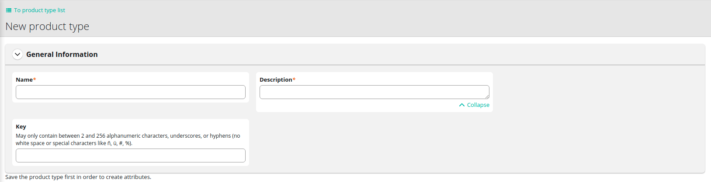

# Getting started

# How to setup commercetools store with Vue Storefront?

This short description is here to guide you all the way to create simple working store based on the commercetools integration.
First you need to go prepare commercetools instance in Merchant Center. After signing up following [this guide](https://docs.commercetools.com/merchant-center/accounts) you can start preparing your project.

## Commercetools settings

Project is the set of data and store configuration which allows you to manage and provide input for VSF Next to display it in proper way. You can have more than one project with different settings and independent data. One project can provide data for multiple selling channels.
In order to create one, you need to add it in 'manage projects' menu by setting name, key and organization.

<center>
  
</center>

For further information please see the [following guide](https://docs.commercetools.com/merchant-center/projects#creating-a-project)

Preparing configuration for your store consist of few steps to make it ready to use with VSF Next  
In 'Project settings' menu you need to define basic settings:

### 'International' tab

Choose currencies that are possible to use in your store:

<center>
  
</center>

Select languages for your products:

<center>
  
</center>

Choose the countries that have separate shipping methods, tax rates, selling channels:

<center>
  
</center>

Setting zone is helpful when few countries share the same delivery costs. You need to configure at least one shipping zone to set up shipping methods.

<center>
  
</center>

### 'Taxes' tab

In the taxes tab you should configure the rates that are valid for the countries which you provided in 'International' tab.

<center>
  
</center>

### 'Shipping methods' tab

Next step needed to run your shop is to provide shipping methods. First choose if it will be fixed (one per currency) or tiered (more specified depending on cart value, classification or score). For more details please see [documentation](https://docs.commercetools.com/merchant-center/project-settings#shipping-methods) or help tooltip next to the switch.
After that you can set specific method for each zone and currency:

<center>
  
</center>

As we are focused on setting up basic working store other settings can be omitted. But if you want to know more about Channels, Stores, searching features and more please see the [documentation](https://docs.commercetools.com/merchant-center/project-settings#channels).

### Products categories

After setting up basic configuration you need to provide categories. They are main structures to organize the products in groups and make them easy to search for the customer. Please see [this guide](https://docs.commercetools.com/tutorials/product-modeling/categories#top) to know more about categorizing items in your store.
In order to create category you need to take few steps:

- first choose name, and category order to decide what will be shown first.
  <center>
    
  </center>
- choose the parent category to which it belongs
  []
- write down the slug (short url for the category)
  <center>
    
  </center>

Please provide category structure with at least two levels, in order to show category page properly (one is on top, inside main menu and second level categories are shown in menu on the left).

### Product catalog

Finally you need to add products and assign them to proper category.
To create any product in commercetools, at least one product type need to be set. It is the sort of template with certain attributes which is used as a base for the product.
Creating product type:

- provide name and description

  <center>
    
  </center>

- click 'add attribute' and choose name, label, constraints, and type
  <center>
    
  </center>

This will let you add product with certain characteristic like so:

- click add product and chose the type
  <center>
    
  </center>
- next type the name and assign tax category (which we previously set)
  <center>
    
  </center>
- add at least one variant of the product with attribute and SKU number
  <center>
    
  </center>
- in final step you can provide slug, keywords and meta data to optimize searching
  <center>
    
  </center>

Adding few products with at least two level deep categories hierarchy will be enough to create basic VSF Next store implementation.

### API settings

The Last important step is to generate credentials for your project to connect both tools.
Go to the developer settings and click 'Create new API client' button and choose manage -> Project scope, but please have in mind that it use all API for the project, so it is not recommended for production use. In that case choose only scopes that are needed.
[]
If you need more information about scopes please see [documentation](https://docs.commercetools.com/api/scopes).
After clicking create API you will see all credentials. There are shown only once so you need to keep them safely. You can download them in the format you need.
[]

Now let's move to front-end side.

## Vuestorefront settings

## Configuring your Commercetools integration

All generated credentials should be used in `middleware.config.js` in `ct` config object inside `integrations`:

```js
    ct: {
      location: '@vue-storefront/commercetools-api/server',
      configuration: {
        api: {
          uri: 'https://<SHOP_DOMAIN>.com/vsf-ct-dev/graphql',
          authHost: 'https://auth.sphere.io',
          projectKey: 'vsf-ct-dev',
          clientId: '<CLIENT_ID>',
          clientSecret: '<CLIENT_SECRET>',
          scopes: [
            //* scopes */
          ]
        },
        currency: 'USD',
        country: 'US'
      }
    }
```

There is plenty of other configuration options and you can check them [here](./configuration.md)
